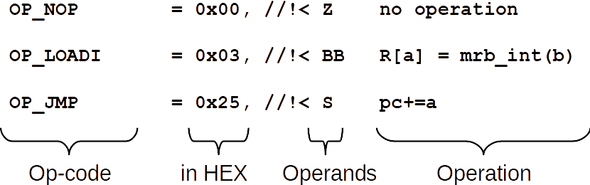

# Executing bytecode

mruby/c VM executes the series of instructions, mruby/c bytecode.

Each bytecode contains op-code and operands. Op-code is always represented by one byte and all op-codes are shown in `opcode.h`.

Operands is variable bytes depends on op-code. The operands are also shown in `opcode.h` as following manner. 

The operand column shows the combination of {Z,B,S,W}. Each means that the following operands appear in that order.

|operand|type of operand|length (bytes)|
|:-:|-|:-:|
|Z|no operand|0|
|B|8 bits operand|1|
|S|16 bites operand|2|
|W|24 bits operand|3|

## Instruction example 1

Because the operand of `OP_NOP` is `Z`, `OP_NOP` does not have any operands. Thus the bytecode is `00`.

`OP_NOP` does nothing, which is called NO-Operation (NOP).

## Instruction example 2

If the instruction begins `OP_LOADI`, this instruction must have two 8-bit operands. Let assume the operands are 0x02 and 0x04, the bytecode is `03 02 04`.

`OP_LOADI` is a load operation from one register to another. The bytecode `03 02 04` means assign register `04` value into register `02`.

## Instruction example 3

If the instruction begins `OP_LOADI`, this instruction must have one 16-bit operand. Let assume the operand is 0x0005, the bytecode is `25 00 05`.

`OP_JMP` is a jump operation. The next instruction is pointed by the offset, which appears in the 16-bit operand. The bytecode `25 00 05` means that the next instruction is located in offset 0x0005 from current instruction `25 00 05`.

Because the offset is signed value, it's necessary to convert from the 16-bit operand to the offset. The converting way is shown later.
